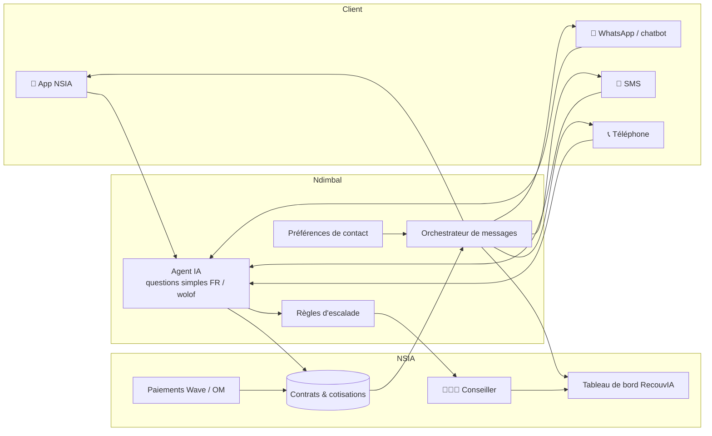

# Architecture — intégration à l'application NSIA existante

> Ndimbal **ne remplace pas** l'application créée par les équipes IT : il s'y ajoute comme un module. Les choix techniques ci-dessous sont des hypothèses à valider avec l'équipe IT (langage, hébergement, API disponibles).

## Vue d'ensemble

## Les briques

| Brique | Rôle | Qui la construit |
|---|---|---|
| **Préférences de contact** | Canal préféré, langue, heures de disponibilité, consentement. Nouvel écran dans l'app + saisie possible par le conseiller | IT (app) + projet |
| **Orchestrateur** | Chaque jour, lit les échéances et les retards, choisit le message du parcours (J-3, J+3…) et l'envoie par le canal préféré, avec repli | Projet (prototype Python dans `/prototype`) |
| **Agent IA** | Répond aux questions simples en lisant les vraies données du contrat ; ne donne jamais un chiffre inventé | Projet (Dify en S3) |
| **Règles d'escalade** | Détecte les cas sensibles et transfère au conseiller | Projet |
| **Connecteurs** | SMS (agrégateur local), WhatsApp Business API, serveur vocal | Fournisseurs à choisir avec IT |
| **Tableau de bord** | Suivi des relances et des transferts pour la chargée de recouvrement | RecouvIA |

## API attendues côté application IT (à confirmer)

| Méthode | Route | Usage |
|---|---|---|
| GET | `/clients/{id}/preferences` | Lire canal, langue, horaires, consentement |
| PUT | `/clients/{id}/preferences` | Mise à jour depuis l'app ou par le conseiller |
| GET | `/contrats/{police}/situation` | Montant dû, dernier paiement, prochaine échéance |
| POST | `/notifications` | Envoyer une notification push dans l'app |
| POST | `/demandes` | Créer une demande pour un conseiller |

## Plan de déploiement progressif

| Étape | Contenu | Pourquoi d'abord |
|---|---|---|
| **V0** (cours, S4) | Préférences + orchestrateur + SMS + chatbot texte, sur données fictives | Démontrable rapidement, coûte peu |
| **V1** | Messages vocaux pré-enregistrés en wolof (WhatsApp vocal), appel automatique J+7 | Touche les clients qui ne lisent pas |
| **V2** | Assistant vocal qui comprend le wolof parlé | Technologie à évaluer (qualité de la reconnaissance du wolof) |
| **V3** | Intégration complète à l'app IT et au tableau de bord RecouvIA | Nécessite les API de l'IT |
